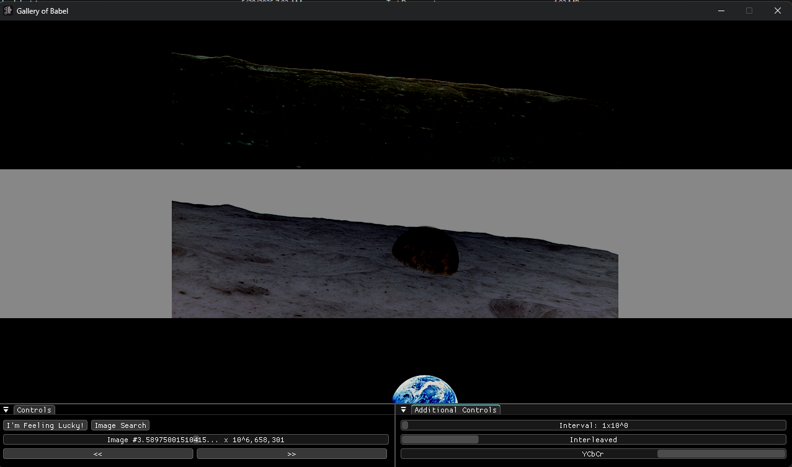

# Gallery of Babel

See every single 720p image that ever did, and ever will exist.

The image-wise version of the library from the short story "Library of Babel" by Argentine author Jorge Luis Borges.

This program can theoretically view every single possible 720pRGB image
as you can set the controls such that it only increments by 1 so that you never
miss a single one. Of course, it is a practical impossibility with how large the space is.
 
## Getting Started

>[!NOTE]
>This is a Windows-only program. 

- Download a release from the [Releases](https://github.com/a22Dv/gallery-of-babel/releases)
 section of this repository.
- Extract and run.

## Controls
-  `Left Arrow` and `Right Arrow` as shortcut keys to jump forward or backward.

## Sample Images

### Interleaved - RGB

### Interleaved - HSV

### Interleaved - YCbCr

### Reversed Interleaved - RGB

### Planar - RGB

## Features

- A Graphical User Interface
- Real-time Interaction
    - Jump forwards and backwards by a set interval
    - Swap interpretation modes at run-time
- Image search (Supports .jpg/.png)
     - Should the file not be a .jpg or .png, 
     it can load the file as a generic bitstream interpreted as an image.
- Various color-space interpretation modes
    - RGB
    - HSV
    - YCbCr
- Various bit interpretation modes.
    - Interleaved 
    - Reversed Interleaved
    - Planar
    - Reversed Planar
    - Gray Code 

## License

This project is licensed under the MIT license - see LICENSE for more details.

## Author

a22Dv - a22dev.gl@gmail.com